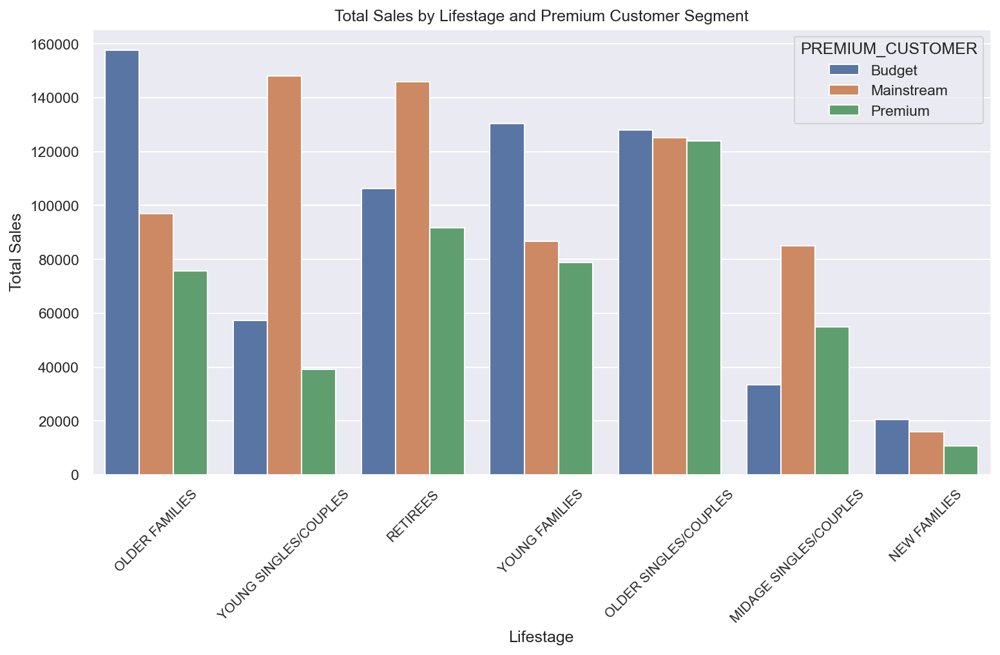
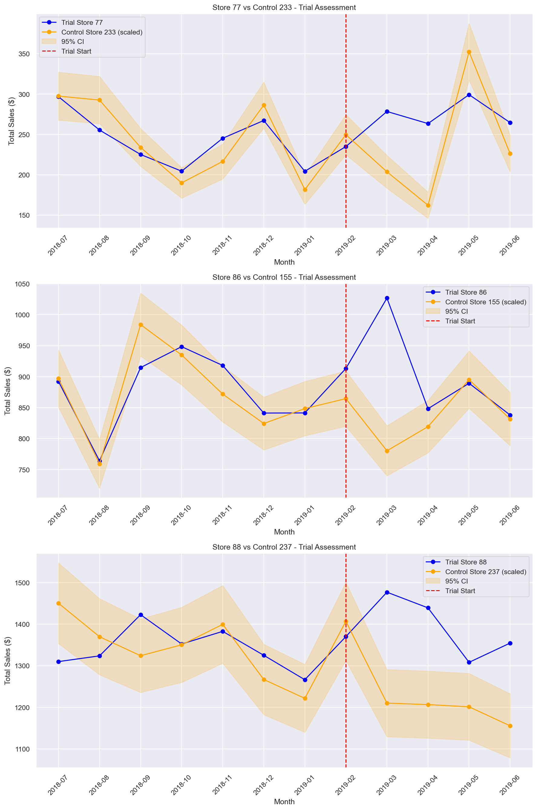

# Quantium Retail Analytics & Store Trial Evaluation
### Retail Analytics | Customer Segmentation | Statistical Testing | A/B Testing 

## Executive Summary
A major retailer sought to understand which customer segments drive chip category revenue and whether a new store format trial produced a meaningful sales uplift. Analyzing 264,836 transactions across 270 stores, this analysis identifies the top revenue-driving customer segments and evaluates trial store performance using quasi-experimental methods. 

Two of three trial stores showed statistically significant sales uplift at 95% confidence. Budget Older Families and Mainstream Young Singles/Couples were identified as the highest value segments — informing targeted promotional and shelf strategy.

**Note:** This analysis was completed as part of the Quantium Data Analytics job simulation on Forage

## Business Problem
The retailer's category management team needed solutions to two tasks:

- **Task 1:** Business lacked a clear understanding of chip purchasing behavior across customer segments to identify what factors drives chip revenue - making business strategy decisions unclear

- **Task 2:** Evaluate the impact of a new store layout deployed in 3 stores. Without a control group comparison, the business couldn't determine whether any sales were driven by the new layout or by external factors otuside their control.

- **Aim:** Use analysis is to identify high-value customer segments and provide a statistically evaluation of the store trial to support data-driven category and retail strategy decisions across all stores.

## Methodology
1. Data Cleaning and Preprocessing of ~ 265,000 chip transactions across 270 stores.
2. Customer Segmentation - Normalized purchase volume and spend to identify which segments over-index on chip purchases.
3. Control Store Selection - Each trial store was paired with the most similar non-trial store using Pearson Correlation on pre-trial data - verifying sales behavior difference during trial is credited to new store layout.
4. Trial Evaluation using 95% Confidence interval testing to compare trial vs control store performance across trial period.

## Results & Business Recommendation

### Key Findings
- **Budget Older Families** and **Mainstream Young Singles/Couples** are the highest revenue-driving segments — over-indexing on chip purchases relative to their population share

- Normalizing by customer count revealed spend per customer is actually consistent across top segments ($32-$35) -total revenue differences is driven by customer traffic, not spend per individual
- **2 of 3 trial stores** showed statistically significant sales uplift at 95% confidence during the trial period

- **Trial Store 3** showed an early uplift but couldn't hold - no negative impact, suggesting layout had no harm

### Recommendation
**Stakeholder:** Category management and retail strategy teams

Prioritize shelf space, promotional strategy, and new product ranging toward Budget Older Families and Mainstream Young Singles/Couples across all 270 stores. These segments drive the highest return on promotional investment on chip marketing.

Deploy new store format to stores matching the profile of the two successful trial locations before broader rollout. Investigate Trial Store 3 independently — the lack of uplift may reflect local competition or changes in customer demographics.

## Skills & Tools
| Category | Details |
|----------|---------|
| **Language** | Python |
| **Libraries** | Pandas, NumPy, SciPy, Matplotlib, Seaborn |
| **Statistical Methods** | Pearson Correlation, 95% Confidence Interval Testing, Normalization |
| **Concepts** | Quasi-experimental design, control store matching, customer segmentation, brand affinity analysis |  

## Notebooks
- `Quantium_Customer_Segment_Analysis.ipynb` — EDA, cleaning, 
  feature engineering, and segment analysis
- `Quantium_Store_Trial_Assessment.ipynb` — Control store 
  selection and trial impact assessment
