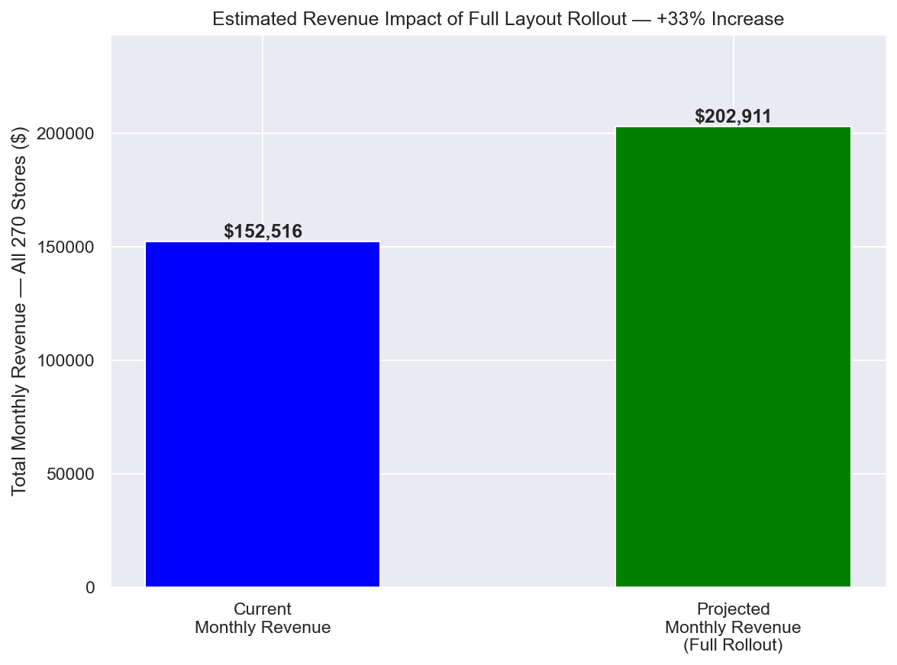
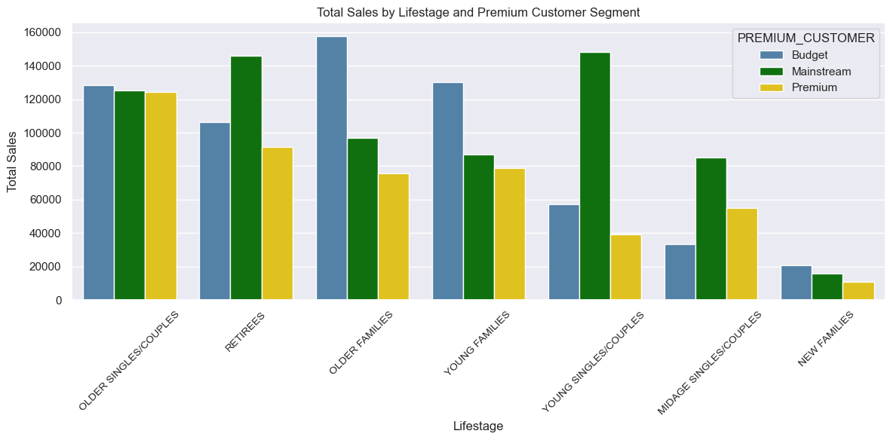
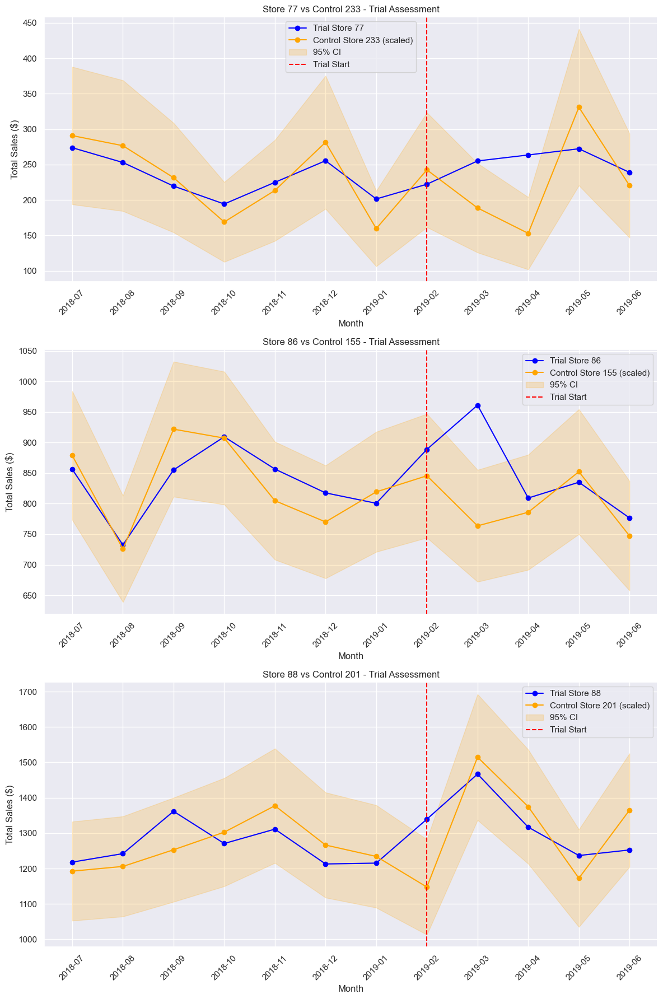

<h1 align="center">Quantium Retail Analytics & Store Trial Evaluation</h1>
<h3 align="center">Customer Segmentation | A/B Testing & Quasi-Experimental Design | Statistical Inference</h3>

## Executive Summary
A major chip retailer needed answers to two connected questions: **which customers actually drive chip category revenue**, and **does a new store layout trial justify a network-wide rollout**. Analyzing 264,836 transactions across 270 stores and 21 customer segments, this project identifies the two highest-value customer segments and rigorously tests the layout trial using a matched-control (quasi-experimental) design — the standard approach for retail experiments where random assignment isn't possible.

**Headline results:**
- **Store 77** delivered a statistically significant, sustained sales uplift (95% confidence), confirmed independently by both a sales test and a customer-traffic test
- The effect is **traffic-driven**: customer count ran 67% above its control store by the final trial month, with no change in per-customer spend
- Generalized across all 270 stores, the observed uplift projects to **~$604,738 in incremental annual revenue** (a 33.0% average lift, conservatively averaged across all three trial months, including an initial adjustment dip)
- **Budget Older Families** and **Mainstream Young Singles/Couples** are the two customer segments driving the most chip category revenue — and the second segment's revenue profile (many customers, modest spend each) is the same "more traffic" mechanism the layout trial proved out, meaning the rollout and the segmentation strategy reinforce each other rather than sitting as two unrelated findings

[→ View Full Deliverable](https://github.com/Hugoortega1025/quantium-retail-analytics/blob/main/report/AB_Test_Consulting_Deliverable.pdf)

## Business Problem
The retailer's category management team needed answers to two connected questions:

- **Task 1 — Segmentation:** Which customer segments actually drive chip category revenue, and why? Without this, shelf space, promotional budget, and range decisions were being made without evidence of who they should target.
- **Task 2 — Store Trial:** A new store layout was piloted in 3 stores. Without a comparison group, the business had no way to tell whether any sales change was caused by the layout or by unrelated factors (seasonality, local conditions, normal store-to-store variation).
- **Aim:** Combine both analyses into a single, data-driven recommendation — who to target, and whether the layout is worth rolling out to all 270 stores.

## Methodology
1. **Data Cleaning** — ~265,000 chip transactions across 270 stores; removed a test account and non-chip products, engineered pack size and standardized brand fields.
2. **Customer Segmentation** — Compared total revenue, spend-per-customer, and volume-per-customer across 21 lifestage/spend-tier segments to separate segments that are large from segments that are individually valuable.
3. **Control Store Selection** — Each trial store was matched to the most behaviorally similar non-trial store using Pearson correlation on pre-trial sales, refined with a store-size filter so trial and control stores are comparable in scale, not just trend shape.
4. **Trial Evaluation** — 95% confidence intervals built from pre-trial variation (using t-distribution critical values, appropriate given the small 7-month pre-trial sample) to test whether trial-period sales and customer counts fall outside what normal variation would predict.

## Results & Business Recommendation

### Who drives chip revenue

- **Budget Older Families** are the clear #1 segment by total revenue — high purchase frequency and large household volume make them the most commercially significant group.
- **Mainstream Young Singles/Couples** rank #2 in total revenue but are near the *bottom* in spend per customer — their revenue comes from having a lot of customers, not big individual baskets.
- This segment shows elevated affinity for a mix of craft and mainstream snack brands (Tyrrells, Twisties, Doritos lead the list) and a preference for large-format packs (270g+), rather than the 175g standard size that dominates overall sales.

### Did the store layout work?

- **Store 77** — statistically significant, sustained uplift confirmed in March and April (following an initial adjustment dip in February), verified by two independent tests: total sales *and* customer count both broke outside the normal-variation band in the same two months.
- **Store 86** — customer traffic was genuinely elevated in February and March, but only translated into a statistically significant sales effect in March; both faded back to normal by April.
- **Store 88** — no statistically significant effect on sales or on either driver metric (customer count, spend per visit). Worth noting: Store 88's matched control had the weakest pre-trial correlation of the three pairs, which is a limitation on how conclusive this null result can be considered.
- Driver analysis confirms the mechanism: where the layout worked, it worked by **bringing more customers into the store** — not by getting existing shoppers to spend more per visit.

### Why these two findings matter together
The layout trial's proven mechanism — more foot traffic, not bigger baskets — is exactly the lever that matters most for the highest-priority segment identified in the segmentation analysis. Mainstream Young Singles/Couples already generate revenue through customer *count* rather than customer *spend*, so a traffic-driving format change is structurally well-suited to compound with that segment specifically, rather than being a generic "good idea" that happens to also exist. This turns two separate analyses into one recommendation: rollout priority should weight not just "which stores resemble Store 77 operationally" but "which stores' customer base skews toward the segments whose revenue is already traffic-sensitive."

### Recommendation
**Stakeholder:** Category management and retail strategy teams

1. **Roll out the layout first to stores matching Store 77's profile** — the only trial store with a statistically defensible, sustained effect, and prioritize locations with strong presence of Budget Older Families and Mainstream Young Singles/Couples, where a traffic-driving layout should compound with existing customer behavior.
2. **Investigate Store 86 before expanding to its profile** — the traffic bump was real but didn't convert into a lasting sales effect; may need supporting in-store activation or promotional programming.
3. **Deprioritize stores matching Store 88's profile** without a redesigned trial that produces a stronger control match.
4. **Independent of rollout timing**, reorient shelf space and promotional priority toward Budget Older Families (multi-buy promotions on high-volume standard SKUs) and Mainstream Young Singles/Couples (brand and large-format pack variety) — these two segments drive the highest return on chip category investment across the full network.

## Skills & Tools
| Category | Details |
|----------|---------|
| **Language** | Python |
| **Libraries** | Pandas, NumPy, SciPy, Matplotlib, Seaborn |
| **Statistical Methods** | Pearson correlation, t-distribution confidence intervals, quasi-experimental (matched-control) hypothesis testing |
| **Concepts** | A/B testing & quasi-experimental design, control store matching, customer segmentation, brand/pack affinity analysis, revenue impact modeling |

## Next Steps & Limitations
- **Trial size:** Only 3 trial stores — a larger trial would provide more statistically robust conclusions before full rollout.
- **Store 88's control match:** The weakest pre-trial correlation (r = 0.48) of the three pairs means its "no effect" result should be read as "no effect detected," not a fully conclusive null.
- **Store 86:** Short-lived effect warrants further investigation — the layout may need additional in-store activation or promotional support to sustain uplift.
- **Causal inference:** Confidence interval testing confirms uplift but can't fully isolate the trial effect from external factors specific to one control store — a difference-in-differences model, or a larger randomized trial, would strengthen causal claims further.

## Notebooks
- `Quantium_Customer_Segment_Analysis.ipynb` — EDA, cleaning, feature engineering, and segment analysis 
- `Quantium_Store_Trial_Assessment.ipynb` — Control store selection and trial impact assessment / quasi-experimental test 

## Data Source
Data and Business Challenge provided by Quantium's Retail Strategy and Analytics virtual experience program on Forage.
- Program: https://www.theforage.com/simulations/quantium/data-analytics-rqkb
